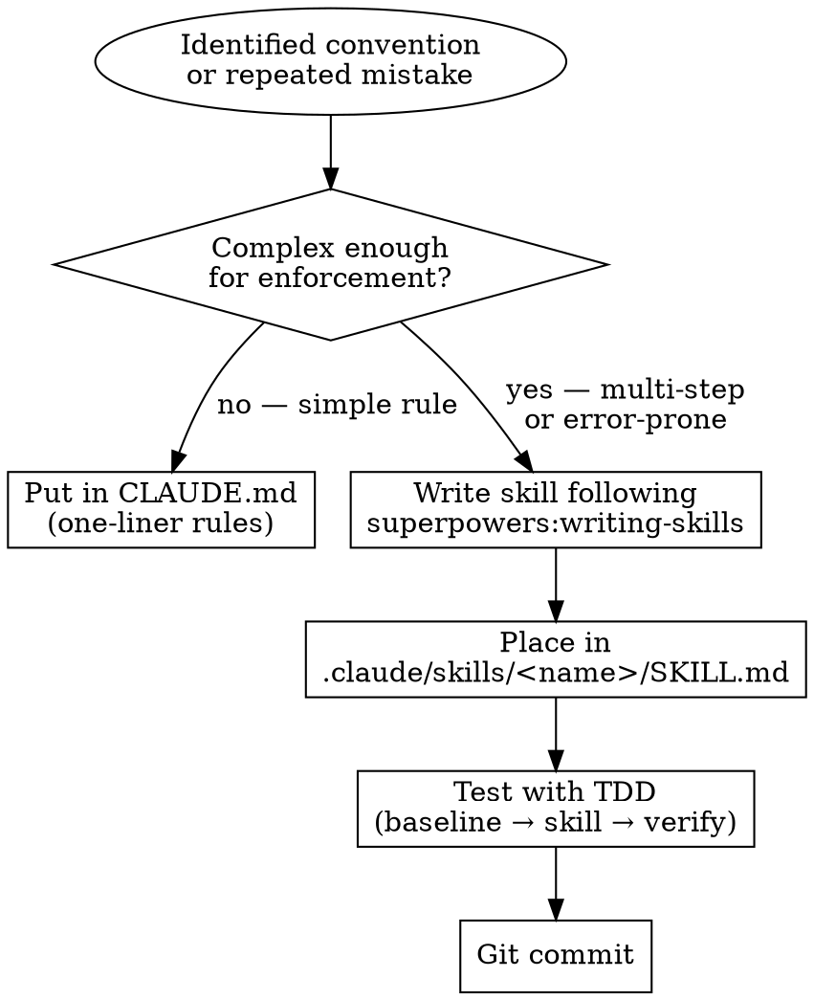

# Crafting Project Skills

## Overview

Convert project-specific conventions, patterns, and workflows into Claude Code skills that live in the project repository. These are distinct from Superpowers skills (universal) — project skills encode "in this project, we always do X for Y."

**Core principle:** If an agent needs to know it to work in this project, and it is not obvious from the code, it should be a project skill.

## When to Use

- Convention rules in CLAUDE.md are growing complex
- Agents keep making the same project-specific mistakes
- Team has tribal knowledge not encoded anywhere
- After recording an ADR whose implications affect daily development

## The Process

**Announce:** "I'm using the crafting-project-skills skill to create a project-specific skill."



**Step 1: Identify the need**

- CLAUDE.md growing unwieldy with project rules
- Same correction given to agents repeatedly
- Convention doc that is effectively a checklist

**Step 2: Determine if it warrants a skill**

- One-liner rule → CLAUDE.md
- Multi-step or error-prone pattern → skill

**Step 3: Write the skill**

**REQUIRED BACKGROUND:** `superpowers:writing-skills` — follow its format, CSO principles, and TDD methodology.

**Step 4: Place in project skill directory**

```
.claude/skills/<skill-name>/SKILL.md
```

**Step 5: Test the skill**

Follow `superpowers:writing-skills` TDD approach:
1. RED: Run scenario without skill, document baseline failures
2. GREEN: Add skill, verify agent now complies
3. REFACTOR: Close loopholes found during testing

**Step 6: Commit**

```bash
git add .claude/skills/<skill-name>/
git commit -m "skill: add <skill-name> project skill"
```

## Red Flags

- **Never** create a project skill for something universal — contribute to Superpowers instead
- **Never** duplicate Superpowers skills — reference them
- **Never** create skills without testing — follow the Iron Law from `superpowers:writing-skills`
- **Never** put project skills in the plugin directory — they go in the project's `.claude/skills/`

## Common Mistakes

| Mistake | Fix |
|---------|-----|
| Skill too broad ("coding standards") | Focus on one specific pattern or workflow |
| Skipping baseline test | You must see agents fail WITHOUT the skill first |
| Description summarizes workflow | Description = triggering conditions only ("Use when...") |
| Putting skill in wrong directory | Project skills: `.claude/skills/`. Plugin skills: plugin dir |

## Integration

- **superpowers:writing-skills** — REQUIRED. Defines format, testing, CSO principles
- **syncing-docs-and-skills** — run after creating a new skill to verify doc references
- **writing-architecture-docs** — ADRs and conventions are inputs
- **auditing-project-docs** — may surface conventions that should become skills
