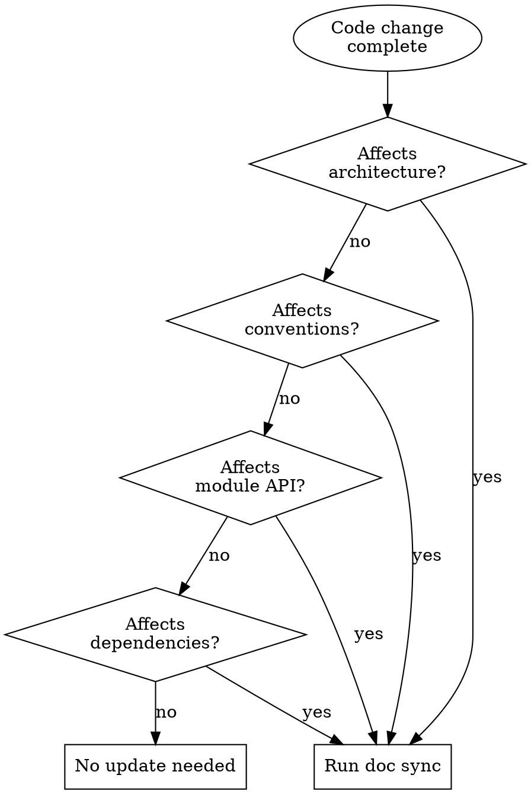

# Syncing Docs with Code

## Overview

Detects when code changes need documentation updates and guides the update process. Runs as a checkpoint before declaring work complete.

**Core principle:** Code and docs are a single unit of work. Changing one without the other creates debt.

## When to Use



- After completing a feature branch (before `superpowers:finishing-a-development-branch`)
- When doc-drift-check reports potential drift
- After refactoring that changes module boundaries
- After adding/removing dependencies
- After changing API contracts

## The Process

**Announce:** "I'm using the syncing-docs-with-code skill to check documentation impact."

**Step 1: Analyze the diff**

```bash
git diff --name-only <base>..HEAD
git diff --stat <base>..HEAD
```

**Step 2: Classify changes**

Read the **Documentation Map** in CLAUDE.md for actual doc paths. For each changed file, check against documentation:
- New files in documented module → module doc may need updating
- Changed file referenced in architecture docs → check accuracy
- New dependency → architecture overview may need updating
- Changed API contracts → API docs need updating
- New directory/module → may need new module doc

**Step 3: Report impact**

```markdown
## Documentation Impact Assessment

### Changes requiring doc updates:
- [ ] <Architecture Overview path> — <reason>
- [ ] <Module Docs path>/<name>.md — <reason>

### No doc impact:
- Internal refactoring (no public API change)
- Test additions (no architectural change)
```

Use actual paths from the Documentation Map in CLAUDE.md.

**Step 4: Guide updates**

For each required update, open the relevant doc and suggest specific edits. Use `writing-architecture-docs` for substantial updates.

**Step 5: Update last-reviewed dates**

For any doc verified still accurate, update `last-reviewed` frontmatter to today.

## Red Flags

- **Never** skip because "it's a small change" — small changes accumulate into stale docs
- **Never** mark docs as up-to-date without actually reading them against new code
- **Never** create new docs during sync without following writing-architecture-docs

## Common Mistakes

| Mistake | Fix |
|---------|-----|
| Only checking files you changed | Also check docs that reference changed files |
| Forgetting dependency changes | Check package.json/Cargo.toml diffs against architecture overview |
| Updating only module docs | Architecture overview may also need updating |
| Skipping because "just tests" | New test patterns may affect testing conventions in CLAUDE.md |

## Integration

- **doc-drift-check** — lightweight pre-check; if drift detected, run this skill
- **syncing-docs-and-skills** — run AFTER this skill to propagate doc changes to dependent skills
- **superpowers:finishing-a-development-branch** — sync runs BEFORE this skill
- **superpowers:verification-before-completion** — doc sync is part of completion verification
- **writing-architecture-docs** — used for substantial doc updates
- **auditing-project-docs** — complementary (syncing prevents frequent audits)
