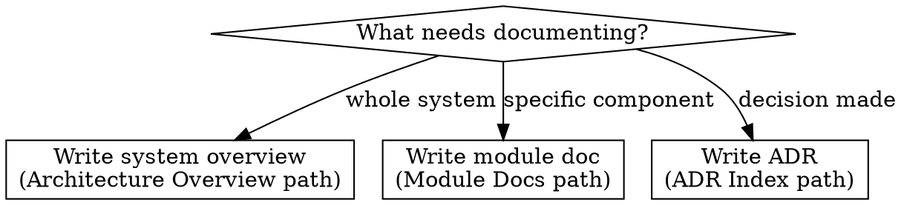

# Writing Architecture Docs

## Overview

Write and maintain architecture documentation: system overview, module docs, and Architecture Decision Records (ADRs). Produces documents that new agents can read to understand the system without reading every source file.

**Core principle:** Architecture docs answer "why is it built this way?" — the one question code alone cannot answer.

## When to Use

- After `superpowers:brainstorming` produces a design
- When a significant architectural decision is made
- When adding a new module or subsystem
- When onboarding a new team member or agent instance

## The Process

**Announce:** "I'm using the writing-architecture-docs skill to document architecture."

Check the **Documentation Map** in CLAUDE.md for actual paths. Defaults shown below.

### System Overview

Write to the **Architecture Overview** path from Documentation Map.

1. Read existing codebase structure
2. Document: purpose, high-level architecture, tech stack, key components, data flow, external dependencies
3. Keep under 300 lines — this is an overview, not a novel

### Module Docs

Write to the **Module Docs** directory from Documentation Map.

1. Read module source code
2. Document: purpose, public API, internal architecture, dependencies, testing approach
3. Include a "Key Files" section listing the 3-5 most important files

### Architecture Decision Records

Write to the directory containing the **ADR Index** from Documentation Map.

1. Use template from `adr-template.md`
2. Number sequentially (check existing ADRs for next number)
3. Update the ADR Index file

All documents must include `last-reviewed: YYYY-MM-DD` frontmatter.

## Red Flags

- **Never** document implementation details that change frequently — document interfaces and contracts
- **Never** skip the "Context" section of an ADR — the "why" is the entire point
- **Never** write architecture docs without reading the code first
- **Never** create an ADR for trivial decisions — use ADRs for decisions that are hard to reverse

## Common Mistakes

| Mistake | Fix |
|---------|-----|
| Writing too much detail | Focus on interfaces, not internals |
| Empty "Consequences" in ADR | Every decision has trade-offs — document both positive and negative |
| Forgetting to update ADR index | Always update the ADR Index (see Documentation Map) when adding an ADR |
| Stale module docs | Use `syncing-docs-with-code` after code changes |

## Integration

- **superpowers:brainstorming** — design output becomes input for architecture docs
- **syncing-docs-with-code** — detects when architecture docs become stale
- **superpowers:writing-plans** — architecture docs provide context for plan creation
