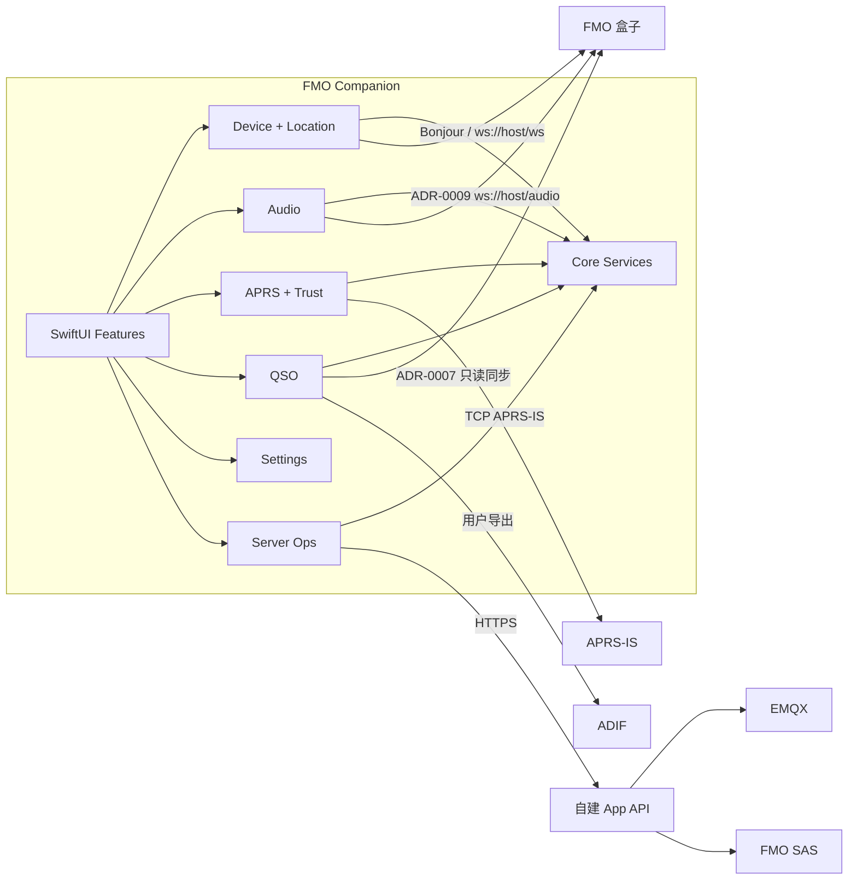

# 架构总览

## 系统目的

FMO Companion 在不接触 FMO 私钥和 MQTT 语音协议的前提下，将 iPhone 的定位、局域网、音频播放、通知、地图、安全存储与文件能力提供给 FMO 用户；本地固定 PCM 接收严格受 ADR-0009 限制。

## 高层架构



## 技术栈

| 类别 | 技术 | 用途 |
|---|---|---|
| 语言 | Swift 6（完整严格并发检查） | App 与测试 |
| UI | SwiftUI | 页面、导航、状态展示 |
| 并发 | Swift Concurrency | 可取消异步任务和 Actor 隔离 |
| 局域网 | Network.framework | Bonjour、端点与可达性 |
| WebSocket | URLSession | GEO、只读状态、QSO 与 ADR-0009 音频协议 |
| 音频 | AVFoundation | 用户显式开启后的本地 PCM 播放 |
| 定位 | Core Location | 手动与后台位置更新 |
| 系统网页 | SafariServices | FMO 官方管理与 QSO 页面 |
| 后续系统投影 checkpoint | ActivityKit、WidgetKit | 支持源码保留；扩展不被主 App 依赖或嵌入，0.3 不运行 |
| 地图 | MapKit | FMO/APRS 节点与 QSO 地图 |
| 安全 | CryptoKit、Keychain、LocalAuthentication | 签名、哈希、秘密与二次确认 |
| 数据 | SwiftData | App 状态、消息与按设备隔离的 QSO 缓存 |
| 通知 | UserNotifications、APNs | 本地与远程通知 |
| 测试 | Swift Testing、XCUITest | 单元与用户流程 |

## 关键组件

### DeviceConnectivity

负责发现、手动端点、WebSocket 生命周期、GEO 请求/响应和诊断。它不拥有定位权限；`DeviceHomeModel` 在 `MainActor` 上把服务状态投影给 SwiftUI。官方管理与 QSO URL 只从已验证端点构造，再交给 `SFSafariViewController`，App 不读取页面 DOM。

### LocationSync

负责 Core Location 授权、位置更新、固定模式的时间/距离节流和同步调度。节流只处理系统已交付的位置事件，以最后成功同步为检查点，并通过独立的 `FmoGeoClient` 写入设备；离网时不持久化精确坐标。它与设备首页共享稳定端点存储，但不共享前台 GEO 会话；App 启动时按已保存模式重建系统定位会话。

### Dashboard

负责把 GEO、ADR-0005 本地只读设备状态、本地讲话事件和未来 APRS 等彼此独立的来源聚合为同一个类型化 `DashboardSnapshot`。每个字段保留来源、观测时间、可信度和可用性；0.3 只交付首页白名单投影。`FMOcLiveActivity` Widget Extension 与 ActivityKit 支持源码作为后续探索 checkpoint 保留；主 App 不依赖或嵌入该扩展、不声明实时活动能力，运行时组合也不会创建或恢复活动。精确坐标、未知响应字段与原始帧不进入 Dashboard。

### Audio

使用与状态、事件和 QSO 分离的 `FmoLocalAudioClient` 接收 ADR-0009 固定 PCM，把有界瞬时波形交给横屏仪表盘，并在用户显式开启时通过 AVFoundation 播放后续帧。它只在 App active 且横屏可见时工作，不录制、不持久化、不上传、不转发，也不参与讲话者判定。详细边界见 `docs/architecture/modules/audio.md`。

### APRS

由只读 APRS-IS 传输、身份持久化、前台会话协调、CRLF/TNC2 分帧、FMO V4 语义解析、信任验证、短期聚合、SwiftData 收藏和 MapKit/SwiftUI 投影组成。传输使用 `pass -1` 与 `u/APFMO4`，并以 `UnverifiedFMOV4Frame` 隔离未验签输入；业务层没有 APRS 数据帧发送接口。`FMOV4Verifier` 完成 CERT、官方 Root/Intermediate、有效期、CRL、Ed25519、timeSalt 与 JOINT/EVENT 关系验证后，领域记录才进入地图、目录和事件流；失败输入只形成无原文诊断计数。详细边界见 `docs/architecture/modules/aprs.md`。

### QSO

通过与 Dashboard 分离的 ADR-0007 类型化只读会话，从用户所选 FMO 分页同步 QSO 摘要，并按查看或导出需要串行补齐详情。缓存按设备稳定身份隔离；离线展示最后完整成功快照，普通界面不把局域网同步记录表述为经过数据库签名验证。

实现由严格白名单的 `FmoQSOReadClient`、SwiftData 缓存、前台生命周期协调和 SwiftUI/MapKit/ADIF 投影组成；完整分页成功前不执行删除对账。详细边界见 `docs/architecture/modules/qso.md`。

### Settings

负责首版真实可用的全局外观、隐私政策、系统权限与关于。外观偏好通过 `AppStorage` 投影到根视图；产品元数据从 Bundle 读取；公网隐私政策仅接受集中配置的 HTTPS 地址，未配置的开发构建回退到 App 内政策。设置模块不读取业务数据或秘密，也不为通知、自建服务器、快捷指令和小组件创建占位入口。详细边界见 `docs/architecture/modules/settings.md`。

### ServerOps

只连接独立 HTTPS API，不直接暴露或调用公网 SAS 鉴权端点和 EMQX Dashboard 凭据。

## 数据流

### GEO 同步

```text
Core Location event
→ Location policy（权限、精度、时间/距离阈值）
→ FmoGeoClient.setCoordinate
→ WebSocket envelope
→ 盒子响应
→ 同步结果与有限诊断状态
```

### 设备仪表盘

```text
GEO coordinate ──────────┐
local status / events ───┼→ DashboardStore actor → DashboardSnapshot
future trusted APRS ─────┘                         ├→ home projection
                                                  └→ deferred ActivityKit checkpoint（0.3 不启动）
```

### FMO V4 APRS

```text
APRS-IS line
→ strict CRLF / 512-byte framer
→ TNC2 packet parser
→ unverified FMO V4 frame
→ strict deterministic CBOR + CERT parser
→ certificate + CRL + Ed25519 + replay validation
→ authenticated domain record（含 CRL 新鲜度）
→ reducer / MapKit / directory / event stream / SwiftData favorites
```

### QSO

```text
selected FMO endpoint
→ typed qso/getList pages
→ device-scoped summary cache + index
→ recent/on-demand qso/getDetail hydration
→ query / Maidenhead region map
→ cancellable detail completion
→ ADIF export
```

## 外部依赖与信任边界

- FMO 盒子局域网服务：用户拥有但所有响应仍作为不可信输入解析。
- APRS-IS：公开网络，必须验证 FMO V4 身份并防重放。
- FMO 根/中间证书与 CRL：公开信任材料，可缓存但必须保留更新时间。
- 自建 API：用户控制，使用 HTTPS 与短时令牌。
- iOS 系统服务：定位、Keychain、LocalAuthentication、通知。

## 演进原则

- 先完成端到端最小闭环，再抽取稳定接口。
- 不创建尚无真实实现的空模块。
- 新协议或新依赖先记录 ADR。
- 公开能力发生变化时先更新 `docs/references/fmo-open-capabilities.md`，再调整产品范围。
