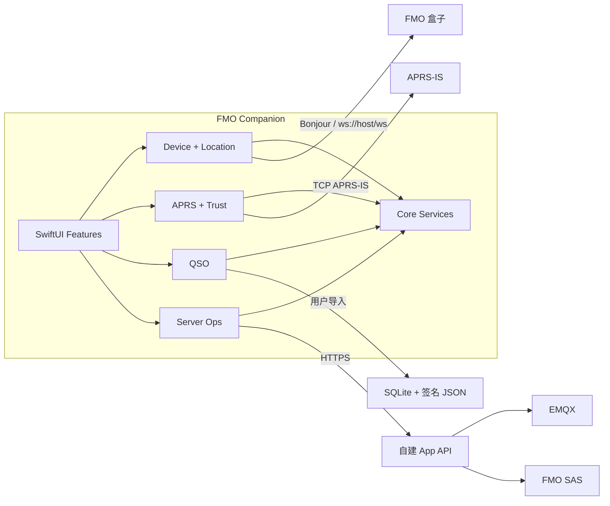

# 架构总览

## 系统目的

FMO Companion 在不接触 FMO 私钥和未公开语音协议的前提下，将 iPhone 的定位、局域网、通知、地图、安全存储与文件能力提供给 FMO 用户。

## 高层架构



## 技术栈

| 类别 | 技术 | 用途 |
|---|---|---|
| 语言 | Swift 6（完整严格并发检查） | App 与测试 |
| UI | SwiftUI | 页面、导航、状态展示 |
| 并发 | Swift Concurrency | 可取消异步任务和 Actor 隔离 |
| 局域网 | Network.framework | Bonjour、端点与可达性 |
| WebSocket | URLSession | GEO 协议 |
| 定位 | Core Location | 手动与后台位置更新 |
| 地图 | MapKit | FMO/APRS 节点与 QSO 地图 |
| 安全 | CryptoKit、Keychain、LocalAuthentication | 签名、哈希、秘密与二次确认 |
| 数据 | SwiftData、SQLite | App 状态与导入日志 |
| 通知 | UserNotifications、APNs | 本地与远程通知 |
| 测试 | Swift Testing、XCUITest | 单元与用户流程 |

## 关键组件

### DeviceConnectivity

负责发现、手动端点、WebSocket 生命周期、GEO 请求/响应和诊断。它不拥有定位权限；`DeviceHomeModel` 在 `MainActor` 上把服务状态投影给 SwiftUI。

### LocationSync

负责 Core Location 授权、位置更新、时间/距离节流和同步调度。通过 `FmoGeoClient` 接口写入设备。

### APRS

由传输、帧解析、FMO V4 语义解析、信任验证、存储和地图投影组成。未通过验证的数据仍可用于诊断，但不能显示为可信。

### QSO

读取用户选择的文件，保持原件只读，构建 App 内索引，执行哈希/签名验证并生成 ADIF。

### ServerOps

只连接独立 HTTPS API，不直接暴露或调用公网 SAS 鉴权端点和 EMQX Dashboard 凭据。

## 数据流

### GEO 同步

```text
Core Location event
→ Location policy（权限、精度、时间/距离阈值）
→ FmoGeoClient.setCoordinate
→ WebSocket envelope
→ 盒子响应
→ 同步结果与有限诊断状态
```

### FMO V4 APRS

```text
APRS-IS line
→ APRS frame parser
→ FMO V4 payload parser
→ CERT/CBOR parser
→ certificate + CRL + Ed25519 + replay validation
→ trusted domain event
→ storage / map / notification
```

### QSO

```text
Files picker
→ sandboxed read-only copy
→ schema validation
→ optional SHA-256 + P-256 signature verification
→ query/index
→ ADIF export
```

## 外部依赖与信任边界

- FMO 盒子局域网服务：用户拥有但所有响应仍作为不可信输入解析。
- APRS-IS：公开网络，必须验证 FMO V4 身份并防重放。
- FMO 根/中间证书与 CRL：公开信任材料，可缓存但必须保留更新时间。
- 自建 API：用户控制，使用 HTTPS 与短时令牌。
- iOS 系统服务：定位、Keychain、LocalAuthentication、通知。

## 演进原则

- 先完成端到端最小闭环，再抽取稳定接口。
- 不创建尚无真实实现的空模块。
- 新协议或新依赖先记录 ADR。
- 公开能力发生变化时先更新 `docs/references/fmo-open-capabilities.md`，再调整产品范围。
