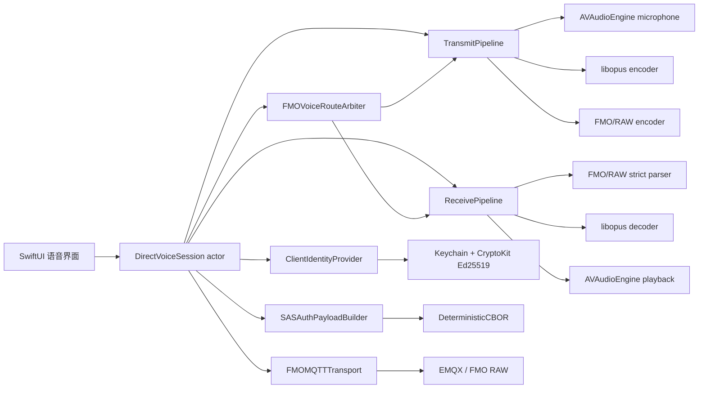

# 计划 0010：iOS 直连 FMO 语音客户端

## 1. 文档目的

本文是 FMO Companion 增加“iPhone 不依赖 FMO 盒子、直接连接 FMO MQTT 服务器收听和按键发话”能力的实施说明。开发人员应能仅凭本文、关联 ADR 和官方资料完成设计、编码、测试与真机验收。

本能力不是提取盒子身份或伪装官方硬件。App 必须使用自己的 Ed25519 私钥和 User Certificate：

- 当前自建网络使用服务器管理员显式信任的自建 Root CA 签发 App 证书。
- 如果未来官方提供 App 证书申请/审批接口，只替换身份签发提供者，SAS、MQTT、FMO/RAW 和音频管道保持不变。
- 任何时候都不得读取、复制、导入或复用 FMO 盒子的私钥。

本计划由 [ADR-0011](../adr/0011-direct-fmo-mqtt-voice-client.md) 批准，并修订 ADR-0001/0009 中排除 MQTT 语音的旧边界。

## 2. 当前结论与验证基线

截至 2026-08-23，结论是：**在服务器管理员为 App 的签发根增加信任后，iOS App 具备完成双向 FMO 语音客户端的全部必要协议能力。**

已经完成的独立脚本验证采用脱敏的 App 专用身份，未使用盒子私钥：

| 链路 | 结果 | 证明的能力 |
|---|---|---|
| SAS 登录 | 通过 | 自建 Root → Intermediate → App User Certificate、Ed25519 proof 与 MQTT CONNECT 可被 SAS 接受 |
| App → MQTT | 通过 | Opus 编码、FMO/RAW 打包、CRC32、QoS 0 发布和 Broker 回环一致 |
| MQTT → App | 通过 | 可接收真实盒子的 FMO/RAW 包，严格解析并解码为 8 kHz 单声道 PCM |
| 双向身份隔离 | 通过 | App 使用软件 vendor 与独立 UID，不冒用官方硬件 vendor/UID |

一次脱敏实测中，App 发送 1.12 秒测试音，共 28 个 Opus 帧、6 个 FMO/RAW 包，6 个发布包均收到 Broker 回环；接收方向取得 9 个真实语音包、48 个 Opus 帧、1.92 秒音频，CRC、帧计数和 Opus 解码全部通过。真实证书、私钥、服务器指纹、呼号和音频样本不得复制进仓库。

这些结果证明协议闭环，不等同于 App Store 生产验收。生产版本仍需完成本文的安全、生命周期、异常输入、后台限制和真机矩阵。

## 3. 范围

### 3.1 首个可交付版本

- 用户导入或完成签发一份 App 专用 FMO V4 身份。
- 用户添加一个明确授权的 FMO 服务器配置。
- 前台连接 MQTT 3.1.1，订阅 `FMO/RAW` 并播放当前获胜路由的 Opus 语音。
- 用户按住 PTT 时采集麦克风、编码并向 `FMO/RAW` 发送语音。
- 实现官方公开的半双工、路由仲裁、1500 ms 占用窗口和连续上行时长限制。
- 连接、鉴权、占用、接收、发射、被抢断和错误状态均有清晰 UI。
- 私钥仅存 Keychain，原始语音仅存在于有界内存，不录音、不上传到其他服务、不进入日志。

### 3.2 明确不做

- 不导出、复制或使用 FMO 盒子私钥，也不把盒子证书与 App 身份混为一体。
- 不承诺自建证书可进入未信任该 Root CA 的其他服务器；服务器管理员保有准入权。
- 不伪造官方 `vendor = 0x0000`，不使用保留 vendor 区或冒用正式 vendor。
- 不在 App 内实现未知的官方人工审批接口；接口未公开时只显示“当前不可用”。
- 不绕过 SAS、FAS、CRL、黑名单、服务器 ACL、通联时长或路由仲裁。
- 不承诺普通 MQTT socket 在 iOS 后台常驻；PushToTalk/APNs 后台方案作为后续独立阶段。
- 首版只编码 Opus；接收端遇到 RADPCM 应显示“不支持的编码”并安全丢弃，除非后续按官方算法增加独立解码器。
- 不提供录音、回放历史、变声、跨网桥接、自动发射、声控发射或无人值守发射。

## 4. 事实来源与可信度

实现时必须区分三类事实：

| 级别 | 含义 | 使用方式 |
|---|---|---|
| 官方公开 | 官方文档或官方开源仓库明确声明 | 可作为协议常量与生产实现依据 |
| 本地实测 | 在用户自建服务器与真实盒子上完成端到端测试 | 可作为兼容性基线，但不能替代官方变更跟踪 |
| 尚未公开 | 官方 App 证书申请、移动端审批、APNs 唤醒等没有公开契约 | 只保留抽象和 UI 状态，不猜测接口 |

协议参考固定在本文末尾。开发开始和发布前均应重新核对官方语音文档、SAS 最新 Release、vendor 注册表和证书工具；任何线格式变更应先更新本文与测试向量。

## 5. 总体架构



核心原则：

- UI 不直接操作密钥、MQTT、Opus 或二进制缓冲。
- 身份、鉴权、传输、线格式、音频和路由仲裁分别通过协议注入。
- 长生命周期对象使用 Actor 隔离；音频实时回调只做无分配或有界拷贝，不直接更新 SwiftUI。
- 所有外部字节均先严格验证，再进入音频解码或业务状态。
- 旧的盒子本地 `/audio` 监听与新的公网 MQTT 语音是两个独立来源，不复用会话或协议模型。

## 6. 建议源码布局

不要一次创建空目录；按实现切片逐步落地：

```text
FMOc/Features/Voice/
├── Identity/
│   ├── FMOClientIdentity.swift
│   ├── ClientIdentityProvider.swift
│   ├── SelfHostedIdentityProvider.swift
│   ├── OfficialIdentityProvider.swift
│   └── FMOIdentityKeychainStore.swift
├── Authentication/
│   ├── FMOServerProfile.swift
│   ├── SASAuthPayload.swift
│   └── SASAuthPayloadBuilder.swift
├── Transport/
│   ├── FMOMQTTTransport.swift
│   └── MQTTNIOTransport.swift
├── Protocol/
│   ├── FMORawPacket.swift
│   ├── FMORawParser.swift
│   ├── FMORawEncoder.swift
│   ├── CRC32.swift
│   └── UInt32WrappingTime.swift
├── Codec/
│   ├── FMOAudioCodec.swift
│   └── LibOpusCodec.swift
├── Audio/
│   ├── VoiceCaptureEngine.swift
│   ├── VoicePlaybackEngine.swift
│   └── VoiceJitterBuffer.swift
├── Session/
│   ├── DirectVoiceSession.swift
│   ├── FMOVoiceRouteArbiter.swift
│   └── DirectVoiceSessionState.swift
└── UI/
    ├── DirectVoiceView.swift
    ├── VoiceIdentityView.swift
    └── VoiceServerSettingsView.swift
```

对应测试放入 `FMOcTests/Voice/`，按相同层次组织。

## 7. 身份、证书与 UID

### 7.1 统一身份接口

身份实现必须先冻结以下能力，后续不得让 MQTT 层读取裸私钥：

```swift
protocol ClientIdentityProvider: Sendable {
    func currentIdentity() async throws -> FMOClientIdentity
    func sign(_ data: Data) async throws -> Data
    func certificateFingerprint() async throws -> Data
    func revocationStatus(at date: Date) async throws -> FMORevocationStatus
}

struct FMOClientIdentity: Sendable, Equatable {
    let callsign: String
    let uid: UInt32
    let userCertificate: FMOUserCertificate
    let intermediateCertificate: FMOIntermediateCertificate
    let issuerIdentity: FMOIssuerIdentity
}
```

`FMOIssuerIdentity` 至少含 Root fingerprint、Intermediate serial number 和来源类型。业务身份主键使用 `rootFingerprint + uid`，不能只使用 UID。

### 7.2 自建身份

推荐流程：

1. App 在本机生成 `Curve25519.Signing.PrivateKey`；CryptoKit 这里实现的是 Ed25519。
2. App 只导出 32 字节公钥、用户填写的规范化呼号和签发请求标识。
3. 自建 CA 管理员在其 UID 登记库中预留 UID，由受信任 Intermediate CA 签发 User Certificate。
4. App 导入 Intermediate Certificate 与 User Certificate，验证链、有效期、呼号、UID 和公钥匹配后才保存。
5. 私钥保存在 Keychain，证书作为非秘密结构化数据保存；删除身份必须同时删除 Keychain 项。

为了兼容当前已完成的测试，可以在 Debug/内部构建提供一次性“导入身份包”；Release 不得导入明文私钥文件。生产流程应优先本机生成密钥、只交换公钥。

Keychain 首版使用 `kSecAttrAccessibleWhenUnlockedThisDeviceOnly`。这意味着设备锁定后若 MQTT 断线，App 不能重新签名登录；首版只承诺前台使用，因此这是正确的安全取舍。若未来批准后台 PTT，再单独评审是否切换到 `kSecAttrAccessibleAfterFirstUnlockThisDeviceOnly`。

> Secure Enclave 不支持 Ed25519。不得把 P-256 Secure Enclave 密钥冒充 FMO 身份密钥，也不得因此降级为在 UserDefaults 或文件中保存 seed。

### 7.3 未来官方身份

`OfficialIdentityProvider` 在官方没有公开 App 签发接口时只能返回 `.enrollmentUnavailable`，不能硬编码网页、模拟设备激活或上传 MAC 地址。未来接入必须满足：

- App 本地生成 Ed25519 私钥，官方只取得公钥和审批所需材料。
- 官方返回的 User Certificate 与 Intermediate Certificate 经过与自建身份相同的本地验证。
- SAS/MQTT/语音层只依赖 `ClientIdentityProvider`，不判断“官方/自建”。
- 证书续期、吊销、身份迁移和审批状态均由 Provider 内部处理。

### 7.4 UID 唯一性

- UID 由签发方分配，不由 App 每次安装随机生成，也不由客户端自行递增。
- 自建网络当前策略可使用 `1_000_000_000...1_999_999_999` 高位范围，并让 Intermediate CA 的 `uidRange` 限制到同一区间；这是本网络策略，不是官方保留号段。
- CA 侧登记表必须以事务和唯一约束保证 `(issuer/root, uid)` 不重复；相同呼号可因不同用途拥有不同证书，但每份证书的 UID 必须明确登记。
- 官方身份未来直接采用官方分配 UID，不映射或覆盖自建 UID。
- `vendor` 与 UID 完全不同：UID 是证书身份，vendor 是 FMO/RAW 实现来源标识，不能互相替代。

## 8. 服务器配置模型

```swift
struct FMOServerProfile: Sendable, Equatable, Identifiable {
    let id: UUID
    var displayName: String
    var dialHost: String
    var targetHost: String
    var mqttPort: UInt16
    var serverUID: UInt32
    var serverCallsign: String
    var serverCertificateFingerprint: Data // exactly 32 bytes
    var expectedRole: FMOUserRole           // default .user
    var transportSecurity: MQTTTransportSecurity
}
```

- `dialHost` 是实际 TCP 连接地址；`targetHost` 是 SAS 配置的 MQTT 主机名。二者通常相同，但 DNS 排障时允许前者是 IP。
- proof 必须签 `targetHost`，不能签 `dialHost`；`targetHost/port/UID/callsign/fingerprint` 任一项与 SAS 不一致都会拒绝。
- 服务器指纹必须是服务器 User Certificate TBS CBOR 的 SHA-256，不是 TLS 证书指纹、域名哈希或公钥哈希。
- 普通 App 身份的 `expectedRole` 为 `user`。管理员显式配置 `admin/super` 时，SAS 仍会独立重算角色，不会因客户端声明而提权。
- 配置优先来自完整验证的 FMO V4 STATION 广播：聚合层必须保留签名证书的规范呼号和 TBS SHA-256 指纹，选择器据此自动生成完整 Profile。实体盒子 ADR-0010 的 UID/名称目录字段不足，不能作为 Direct Voice 身份来源。手工输入仅作为高级回退，UI 必须逐项展示并要求确认。
- 验签产生的完整 Profile 可按服务器 UID 持久化并由同 UID 的后续 STATION 原子刷新；这是公开 SAS 鉴权元数据缓存，不是在线状态、公共服务器收藏或绕过新证书验证的信任锚。
- 服务器配置不含秘密，可以用 SwiftData 保存；私钥与任何未来签发令牌仍只在 Keychain。

当前自建服务器可能只开放 MQTT 1883。Debug/内部验证可连接明文端口，但 Release 应优先支持 EMQX TLS 8883，并对明文公网连接显示明确警告。MQTT over TLS 只保护传输，不能替代 FMO 证书 proof。

## 9. SAS 登录实现

### 9.1 MQTT CONNECT

- 协议：MQTT 3.1.1。
- `cleanSession = true`。
- `keepAlive = 30` 秒；客户端应在约 15 秒空闲时允许库发送 PINGREQ。
- `username = identity.callsign.uppercased()`。
- `password = base64url(compactUTF8JSON)`，无 `=` padding。
- 每次连接和每次重连都重新生成 timestamp、proof 和 password；不得缓存过期 password。
- Client ID 建议为 `fmoc-ios-<uid>-<installSuffix>`；`installSuffix` 是 Keychain 中的随机安装标识，不含设备名、呼号或广告标识。

App 不直接调用 SAS `/auth`。EMQX 收到 CONNECT 后把 username/password 通过内部 HTTP 回调交给 SAS。

### 9.2 password JSON

```json
{
  "certPackage": {
    "intermediateCert": { "...": "完整 Intermediate Certificate JSON" },
    "userCert": { "...": "完整 User Certificate JSON" }
  },
  "targetCallsign": "SERVER_CALLSIGN",
  "targetUID": 12345,
  "role": "user",
  "targetUrl": "mqtt.example.net",
  "targetPort": 8883,
  "serverFingerprint": "base64url-32-byte-fingerprint",
  "timestamp": 1783291399,
  "proof": { "signature": "base64url-64-byte-ed25519-signature" }
}
```

JSON 属性顺序不参与签名；应使用 `JSONEncoder` 或明确 DTO，禁止字符串拼接。编码完成后对整个 UTF-8 JSON 做无 padding Base64url，作为 MQTT password。

### 9.3 proof 的确定性 CBOR

签名输入必须是以下 12 元固定数组，顺序、类型和大小写均是协议的一部分：

```text
[
  "FMO",
  4,
  "serverAuthorizerReqHttp",
  serverUID,
  targetCallsign.uppercased(),
  targetUID,
  role.rawValue,
  targetHost,
  targetPort,
  serverFingerprintBytes,
  timestampUnixSeconds,
  userCertificateFingerprintBytes
]
```

在单服务器场景中 `serverUID == targetUID == profile.serverUID`。字段类型分别为 text、integer、text、integer、text、integer、text、text、integer、32B byte string、integer、32B byte string。

可复用项目现有 `DeterministicCBOR`，但必须新增本签名数组的独立类型化 builder 和固定向量测试，不能让调用方传任意 CBOR 树。

User Certificate 指纹计算：

```text
userTBS = CBOR([
  "FMO", 4, "userCert", issuerSn,
  callsign.uppercased(), uid, publicKey32, iat, exp
])

userCertFingerprint = SHA256(userTBS)
proofSignature = Ed25519.sign(appPrivateKey, proofTBS)
```

SAS 允许的时钟漂移是 ±120 秒。连接前发现系统时间明显异常时应给出可行动错误；不能通过扩大时间窗、重复旧 proof 或关闭验签绕过。

### 9.4 登录失败映射

| 表现 | App 错误 | 用户动作 |
|---|---|---|
| MQTT CONNACK 拒绝 | `authenticationRejected` | 检查身份、服务器字段、角色与服务器信任根 |
| timestamp 超窗 | `clockOutOfSync` | 开启系统自动日期与时间后重试 |
| 证书过期/未生效 | `certificateExpired/notYetValid` | 续期或重新签发 |
| Root 未被服务器信任 | `issuerNotTrusted`（若服务端可诊断） | 联系服务器管理员添加信任；不要自动降级 |
| 指纹/URL/端口不匹配 | `serverProfileMismatch` | 从可信 STATION 或管理员重新导入配置 |
| 网络/TLS 失败 | `transportUnavailable/tlsFailure` | 检查 DNS、端口、证书链和网络 |

生产日志只能记录错误类别、阶段和计数，不记录 password JSON、proof、证书全文、服务器指纹、呼号或 IP。

## 10. MQTT 传输层

定义最小接口隔离具体库：

```swift
protocol FMOMQTTTransport: Sendable {
    func connect(_ request: FMOMQTTConnectRequest) async throws
    func subscribeRaw() async throws -> AsyncThrowingStream<Data, Error>
    func publishRaw(_ payload: Data) async throws
    func disconnect() async
}
```

实现约束：

- 只订阅/发布 `FMO/RAW`，QoS 0，retain 为 false。
- 不启用持久会话、离线队列或自动重放待发音频。
- 连接库自身的自动重连必须关闭或收口到 `DirectVoiceSession`，确保每次重连重新签 proof。
- 收包回调立即复制到有界 `Data` 并交给解析 Actor；不得在 MQTT event loop 上解码 Opus或更新 UI。
- 单条 MQTT payload 上限 1400 字节；超限在进入 parser 前拒绝。
- 发送队列只保留仍在 PTT 会话内的最新实时包；断线或被抢断后立即清空，绝不补发旧语音。
- 网络恢复采用可取消的 1、2、4、8、16、30、60 秒指数退避，前台手动重试可重置退避。

首选依赖是 `swift-server-community/mqtt-nio` 的稳定 2.x，原因是支持 MQTT 3.1.1、Swift Concurrency 和 iOS 所需的 Network.framework/NIOTransportServices。开始实现时先做独立编译 spike，再把通过 Swift 6 完整严格并发检查的精确版本固定到工程；截至本文核对时最新稳定 2.x 为 `2.13.0`。如果该依赖无法满足 iOS 26 严格并发，不要把 `@unchecked Sendable` 扩散到业务层，应改为 Actor 包装或评审 CocoaMQTT 2.x。新增依赖时同步 `THIRD_PARTY_NOTICES.md`。

## 11. FMO/RAW 线格式

所有多字节整数均为**小端序**。MQTT 本身的字符串长度和 Remaining Length 仍遵循 MQTT 网络格式，不得与 FMO payload 的小端序混用。

### 11.1 消息包头：固定 64 字节

| 偏移 | 大小 | 类型 | 字段 | 规则 |
|---:|---:|---|---|---|
| 0 | 2 | UInt16 LE | `version` | 当前必须为 1 |
| 2 | 4 | UInt32 LE | `vendor` | 软件客户端使用 `0x2000...0x2FFF` |
| 6 | 4 | UInt32 LE | `uid` | 必须等于当前 User Certificate UID |
| 10 | 12 | ASCII | `callsign` | 大写、NUL 补齐，最长 12 字节 |
| 22 | 4 | UInt32 LE | `streamBeginUTC` | PTT 流开始 UTC 毫秒低 32 位 |
| 26 | 4 | UInt32 LE | `timestamp` | 当前包 UTC 毫秒低 32 位 |
| 30 | 4 | UInt32 LE | `len` | 含 64 字节头的总长，且 ≤1400 |
| 34 | 2 | UInt16 LE | `frameNum` | 后续传输帧数量，必须 ≥1 |
| 36 | 4 | UInt32 LE | `checkSum` | IEEE CRC32，仅覆盖 64 字节之后的帧区 |
| 40 | 1 | UInt8 | `smeter` | App 无射频 S 表时发 0 |
| 41 | 4 | UInt32 LE | `srvUID` | 当前服务器 UID |
| 45 | 19 | bytes | `reserved` | 发送填 0，接收忽略但计入头长 |

`streamBeginUTC` 在按下 PTT 时生成一次，整个连续发射流保持不变；`timestamp` 每个消息包重新生成。二者会在约 49.7 天回绕，比较必须使用 UInt32 模运算，不能转成普通有符号时间后直接排序。

### 11.2 传输帧：8 字节头

| 偏移 | 大小 | 类型 | 字段 | 规则 |
|---:|---:|---|---|---|
| 0 | 2 | UInt16 LE | `index` | 每个消息包从 1 连续递增 |
| 2 | 2 | UInt16 LE | `len` | 含本 8 字节头 |
| 4 | 4 | UInt32 LE | `reserved` | 发送填 0 |
| 8 | 变长 | bytes | `data` | 一个完整编码语音帧 |

### 11.3 编码语音帧：8 字节头

| 偏移 | 大小 | 类型 | 字段 | 规则 |
|---:|---:|---|---|---|
| 0 | 1 | UInt8 | `compressMode` | 1=Opus，2=RADPCM；0 预留且不用于网络 |
| 1 | 2 | UInt16 LE | `len` | 含本 8 字节头 |
| 3 | 5 | bytes | `reserved` | 发送填 0 |
| 8 | 变长 | bytes | `raw` | 编码器直接输出 |

### 11.4 严格解析顺序

1. MQTT payload 必须为 `64...1400` 字节。
2. 读取固定头，验证 `version == 1`、`len == payload.count`、合法 ASCII 呼号和 `frameNum > 0`。
3. 对帧区计算标准 IEEE CRC32，并常量时间比较 UInt32 结果。
4. 按 `frameNum` 逐帧读取，验证 index 从 1 连续、每层 `len >= headerSize` 且不越界。
5. 最后一帧结束位置必须恰好等于 payload 末尾，拒绝尾随字节。
6. Opus raw 不得为空；首版 RADPCM 只验证固定结构后报告 unsupported，不送入 Opus。
7. 验证 `uid/callsign` 组合与当前路由状态；不能根据 payload 自称内容授予身份权限，身份准入由 SAS 完成。

解析错误只增加脱敏类别计数并丢弃当前包，不能终止整个 MQTT 会话，除非出现持续超限/资源攻击并触发会话级限流。

### 11.5 编码与聚合

- 每个 Opus 帧对应 40 ms、320 个 8 kHz 单声道 Int16 样本。
- 把连续编码帧包装成传输帧；下一帧加入后若总包将超过 1400 字节，先发布当前包。
- 聚合时长不得达到或超过 250 ms；Opus 通常每包最多 6 帧（240 ms）。首版可使用 5 帧/包（200 ms）降低边界风险。
- PTT 释放时立即发布不足一组的尾包；不得用额外静音凑满。
- CRC32 在所有传输帧完全编码后计算，只覆盖帧区。

## 12. Opus 编码器与解码器

必须使用官方 libopus，不自研 Opus。固定参数：

| 参数 | 值 |
|---|---|
| sample rate | 8000 Hz |
| channels | 1 |
| application | `OPUS_APPLICATION_VOIP` |
| frame size | 320 samples / 40 ms |
| bitrate | `OPUS_AUTO`，约 9500 bps |
| complexity | 4 |
| signal | `OPUS_SIGNAL_VOICE` |
| VBR | enabled |
| constrained VBR | enabled |
| max bandwidth | `OPUS_BANDWIDTH_SUPERWIDEBAND`；8 kHz 输入实际受 Nyquist 限制 |

建议把官方 `xiph/opus` 固定版本构建为 iOS Device + Simulator 的 `Opus.xcframework`，由小型 C target 暴露所需函数；截至本文核对时官方最新标签为 `v1.6.1`。必须保存构建脚本、源码版本、SHA-256、BSD 许可证和 Notice，不能只提交来源不明的二进制。

`FMOAudioCodec` 接口至少包含：

```swift
protocol FMOAudioEncoder: Sendable {
    func encode40ms(_ pcm: [Int16]) throws -> Data
    func reset() throws
}

protocol FMOAudioDecoder: Sendable {
    func decode40ms(_ opus: Data) throws -> [Int16]
    func concealLoss() throws -> [Int16]
    func reset() throws
}
```

每个活动流使用独立 decoder；路由切换、长空闲或时间戳明显不连续时重置。所有 libopus handle 只能由其 owning Actor/串行执行器访问。

## 13. 接收链路

```text
MQTT FMO/RAW payload
→ 1400B 上限
→ FMORawParser + CRC32
→ FMOVoiceRouteArbiter
→ 当前获胜流的逐帧 Opus
→ bounded jitter buffer
→ libopus decode / bounded PLC
→ Int16 8 kHz mono
→ AVAudioConverter（设备输出格式）
→ AVAudioEngine speaker
```

接收要求：

- 只播放路由仲裁器当前接受的 UID/stream；被拒绝的竞争流不能混音。
- MQTT QoS 0 不补发。TCP 单连接保证到达顺序，App 不建立离线重放。
- 抖动缓冲以“低延迟优先”：建议启动水位 80 ms，上限 400 ms；超过上限丢最旧未播放帧并记录脱敏计数。
- 仅当 timestamp 差值能可靠推断少量丢帧时，最多调用 3 个连续 40 ms PLC 帧；更大缺口直接重置 decoder，避免制造长段伪音频。
- 新路由获胜时停止旧流、清空旧 jitter buffer、重置 decoder，再开始新流。
- 用户静音只停止扬声器输出，不应改变网络仲裁；但无可见监听需求时可以断开整个 Direct Voice 会话节能。
- 音量、路由和耳机/蓝牙变化交给 `AVAudioSession`，不改变 FMO payload。

接收状态应暴露当前呼号、UID（调试层可见）、接收开始时间、缓冲健康、是否静音和支持/不支持的 codec；不得把未经其他信任来源验证的 payload 呼号表述为执照真实性证明。

## 14. 发射链路

```text
用户按住 PTT
→ 资格/身份/连接/路由/麦克风检查
→ AVAudioEngine capture
→ AVAudioConverter 转 8 kHz mono Int16
→ 320-sample framing
→ libopus encode
→ FMO coded frame + transport frame
→ ≤250ms / ≤1400B aggregate
→ CRC32 + 64B message header
→ MQTT QoS 0 publish FMO/RAW
```

### 14.1 PTT 开始门槛

只有以下条件全部满足才能进入 transmitting：

- App 在前台 active，用户正在持续按住 PTT。
- 身份证书链、有效期、公钥匹配与本地 CRL 状态可接受。
- MQTT 已完成鉴权和订阅。
- 麦克风权限已授权，音频会话配置成功。
- 路由没有被其他 UID 占用，或已按官方仲裁规则过期。
- 本次发射未超过服务器/用户配置的时长上限。

PTT 使用“按住发射、松开发送尾包并立即停止”，首版不提供锁定常发。首次使用前显示业余无线电资质、服务器规则和可能触发远端射频发射的确认；确认只表示用户理解风险，不替代每次按住动作。

### 14.2 音频采集

- 请求 `NSMicrophoneUsageDescription`，权限说明必须双语本地化。
- 使用 `AVAudioSession.Category.playAndRecord` 与适合双向话音的 mode；路由策略默认扬声器，可让用户选择系统支持的耳机/蓝牙 HFP。
- iPhone 硬件通常以 48 kHz Float32 提供音频，必须通过 `AVAudioConverter` 转换；不能假设输入节点直接输出 8 kHz Int16。
- 输入环形缓冲有界，只生成完整 320-sample 帧。结束时不足 320 样本直接丢弃或补零策略必须固定并测试；首选短补零后发送一个尾帧，但总补零不得超过 39.875 ms。
- 麦克风 PCM、Opus payload 和 FMO/RAW 包均不落盘、不进入诊断或崩溃附件。

### 14.3 Header 值

- `vendor`：首个开发版本集中配置为软件区值，例如 `0x2000`；正式发布前再次检查官方 registry。自由软件区可能冲突，不得表述为官方分配。
- `uid/callsign`：只来自当前已验证 App User Certificate。
- `streamBeginUTC`：PTT 成功占用时的 UTC 毫秒低 32 位，整段保持不变。
- `timestamp`：每包生成时 UTC 毫秒低 32 位。
- `srvUID`：当前 `FMOServerProfile.serverUID`。
- `smeter`：App 没有射频 S 表，固定 0。
- 所有 reserved：固定全 0。

### 14.4 立即停止条件

- 用户松开 PTT。
- 其他流按官方规则抢占成功。
- MQTT 断开、App 离开 active、音频中断或麦克风路由丢失。
- 证书/身份状态变为不可用。
- 达到默认 60 秒连续上行上限。
- 本地编码、打包或发布持续失败。

停止时清空未发布实时队列、释放输入 tap、结束音频 capture，并向 UI 给出原因。断线恢复后绝不能自动继续发射，必须等待用户重新按住 PTT。

## 15. 半双工与路由仲裁

使用独立 `FMOVoiceRouteArbiter` 实现官方规则，时钟可注入并使用 UInt32 回绕安全比较：

1. 同 UID 的新包续占并刷新 1500 ms 占用窗口。
2. 当前路由超过 1500 ms 没有包，新包占用。
3. 新流 `streamBeginUTC` 更早，且只早不超过 2 秒，新流抢占。
4. 起始时间相同，UID 更小者抢占。
5. 其他情况拒绝。

补充约束：

- App 同一时刻只能 `receiving` 或 `transmitting`，不能混音或全双工。
- 当前方向超过 1 秒无数据后，才允许切换到反方向。
- App 无法感知远端盒子射频信道是否物理占用，只能依据网络路由判断；UI 应称“网络通道”，不能承诺射频绝对空闲。
- 被抢断时立即停止上行并提示“通道繁忙”；不得尝试提高 UID、篡改起始时间或自动重抢。
- 默认连续上行 60 秒；可由服务器公开策略收紧。App 不能设置为比服务器更宽松。

必须为同 UID 续占、窗口超时、早流 2 秒边界、相同时间小 UID、UInt32 回绕、抢断发射和 1 秒方向切换建立确定性测试。

## 16. 会话状态机

```text
idle
→ loadingIdentity
→ authenticating
→ subscribing
→ listening
   ├→ receiving
   ├→ preparingTransmit → transmitting → listening
   ├→ reconnectWaiting → authenticating
   └→ failed
→ disconnecting
→ idle
```

关键不变量：

- 同一时刻最多一个 MQTT connection task、一个 subscription consumer 和一个 reconnect task。
- `transmitting` 必须持有本次 PTT token；旧手势、旧连接和迟到回调不能操作新会话。
- identity/server profile 变化先完整断开，再用新 generation 重连。
- `receiving` 与 `transmitting` 互斥。
- UI 只消费 `DirectVoiceSessionState` 快照，按钮动作通过 Actor 方法进入。
- `deinit` 不是资源释放策略；页面/组合根必须显式调用 `stop()`。

## 17. iOS 前后台与 PushToTalk

首版明确为前台 PTT：

- App 进入 inactive/background 时立即停止发射。
- 如果正在可听接收，可以按现有音频后台政策继续一段由系统允许的播放，但不得宣称 MQTT 永久在线。
- 静音时不得播放无声音频或维持 `AVAudioSession` 逃避挂起。
- 系统终止、用户强制退出、网络切换或资源回收后，消息可能丢失，这是 QoS 0 实时话音的预期行为。

后续如果要实现系统级后台对讲，应单独增加阶段：

- Apple PushToTalk framework 管理系统 PTT UI 和音频会话。
- 自建服务需要 APNs Provider 保存设备 token，并在有新入站语音前发送合规 PTT push 唤醒 App。
- MQTT 仍只承担实时音频；APNs 只做唤醒，不承载语音 payload。
- 该阶段涉及 Push Notification entitlement、服务端、隐私政策、速率限制和真机验收，不能通过简单开启 `audio` background mode 代替。

## 18. UI 与用户流程

### 18.1 统一终端选择

- 设备页现有“选择 FMO 设备”升级为“选择终端”，列表首项固定为“FMO 助手（App 直连）”，其后仍是 Bonjour 与手动添加的实体 FMO。
- 选择 App 直连时，设备页不伪造实体盒子的 GEO、局域网状态、QSO、诊断或本地服务器目录；这些仅实体 FMO 支持的入口按能力隐藏。
- 选择实体 FMO 时立即停止麦克风、清空待发包、断开 Direct Voice MQTT 会话并收回 PTT；App 身份与服务器配置继续安全保存，可从设置进入维护。
- FMO 网络、APRS 消息、收藏呼号等公网能力不依赖当前终端，两个模式继续共用。
- App 直连与实体 FMO 的服务器选择可以复用视觉组件，但数据与命令必须隔离：前者读写 `FMOServerProfile`，后者仍只走 ADR-0010 的盒子 UID 白名单。

### 18.2 身份页

- 显示呼号、UID、签发来源、证书到期日和可用状态。
- 提供“本机生成申请”“导入已签发证书”和未来“官方申请”入口。
- 永不显示、复制或导出私钥；Debug 迁移工具必须从 Release composition 移除。
- 身份删除需要确认，并说明删除后无法恢复对应私钥。

### 18.3 服务器页

- 默认列出当前 FMO 网络快照中经过完整证书验证的 STATION；选择后自动保存名称、目标域名、端口、UID、证书呼号、服务器证书 TBS 指纹和普通用户角色。
- 没有已验证 STATION 时显示可行动空状态，引导用户先在 FMO 网络接收服务器广播；手动添加/编辑上述字段收进高级配置。
- 选择器合并本次会话与过去已验签缓存；缓存项仍可用于连接，但连接结果与后续 STATION 决定其是否仍然有效。
- 显示 TLS/明文传输状态；公网 1883 给出风险提示。
- “测试连接”只做一次鉴权、订阅和立即断开，不发射。
- 保存前验证字段长度、端口、指纹 32 字节和规范化呼号。

### 18.4 设备首页与横屏 PTT

- App 直连模式沿用现有首页仪表盘和横屏全屏仪表盘的信息层级；顶部显示直连服务器、连接状态和 App 身份，当前网络讲话者与接收电平替代盒子本地事件和 `/audio`。
- 两个页面共享一个贴屏幕右侧的 PTT 控件。收起态只显示满足 44 pt 命中区的窄手柄和麦克风图标，不遮挡主信息；点按手柄后，大号 PTT 从右侧滑入。
- 展开态按钮必须要求持续按住才发射，松手立即停止；点按按钮本身不能锁定常发。按钮外点击、切换终端、页面退出、App 非活跃、断网或抢断均立即停止并收回。
- 首页和横屏共享展开状态、会话状态与同一 PTT token，页面切换不得产生第二个发射会话。横屏布局继续尊重安全区，PTT 不能覆盖退出、服务器或视图切换控件。
- 控件明确显示“监听 / 正在接收 / 准备发射 / 正在发射 / 通道繁忙”，并用视觉、触觉和 VoiceOver 公告反馈；状态不能只靠颜色表达。
- PTT 被抢断、达到时限、麦克风中断或网络断开时使用视觉、触觉和可访问性公告反馈。
- Dynamic Type、VoiceOver、Reduce Motion、耳机路由和横竖屏必须可用；状态不能只靠颜色表达。

## 19. 安全、隐私与合规

- 用户必须自行具备适用的操作证、执照、呼号和服务器使用授权；App 不替代资格审核。
- 自建服务器管理员必须显式信任 App Root CA；未被其他服务器信任是正确拒绝，不是需要绕过的故障。
- 私钥只在 Keychain 和 CryptoKit 对象中出现；禁止日志、分析、崩溃附件、截图、fixture、剪贴板和 iCloud 同步。
- 明文 MQTT 1883 会暴露呼号、证书包、短时 proof 和语音内容给链路观察者。生产配置应优先 TLS，并明确展示当前保护级别。
- TLS 使用系统信任或管理员导入的私有 CA；绝不接受所有证书，也不因测试方便关闭主机名验证。
- 证书链验证顺序：结构/上限 → Root trust → Root/Intermediate/User 签名 → issuer/UID 范围 → 有效期 → CRL → 公钥匹配。
- App 不记录原始语音。实时麦克风/解码 PCM、Opus 和 FMO/RAW 只在有界内存中存在，停止会话后释放。
- 任何分析只允许脱敏的阶段、持续时间区间、错误类别和计数；默认不上传。
- 发布前更新隐私政策、麦克风用途说明、第三方许可与 App Store 隐私标签。
- 服务器或 FAS 拒绝、限流、拉黑、吊销时立即服从；App 不自动换身份重试。

## 20. 依赖决策

| 依赖 | 用途 | 建议 | 许可证/动作 |
|---|---|---|---|
| CryptoKit | Ed25519、SHA-256 | 复用 Apple framework | 系统框架 |
| 现有 `DeterministicCBOR` | User TBS 与 SAS proof | 扩展类型化 builder，不引入通用 CBOR | 项目内代码 |
| mqtt-nio 2.x | MQTT 3.1.1、TLS、AsyncSequence | 先做 iOS 26/Swift 6 spike，再精确固定版本 | Apache-2.0；更新 Notice |
| libopus | 8 kHz Opus 编解码 | 从官方 xiph/opus 构建 XCFramework | BSD；保存版本、校验和、许可证 |
| AVFoundation | 采集、转换、播放 | Apple framework | 系统框架 |

不得直接把 Python 验证脚本或其 ctypes 实现移植进 App。脚本只作为第二实现交叉验证；生产代码必须是 Swift/C 的类型化、可取消实现。

## 21. 实施阶段

### 阶段 A：规范与离线协议核心

- [x] 接受 ADR-0011 并同步产品、技术、架构和能力边界。
- [ ] 建立脱敏的 User Certificate、SAS proof、FMO/RAW 与 Opus golden vectors。
- [x] 实现 `FMOClientIdentity`、证书验证、指纹和 `ClientIdentityProvider`。
- [ ] 实现 `SASAuthPayloadBuilder`，与独立脚本逐字节比对 CBOR 和 signature。
- [x] 实现 FMO/RAW parser/encoder、CRC32、UInt32 回绕时间与首版负向测试。
- [x] 构建并验证 libopus XCFramework，完成 40 ms 离线往返。

完成门槛：全程不联网即可完成身份 → proof → Opus → FMO/RAW → parse → decode 的确定性 round trip。

### 阶段 B：只接收 MQTT 闭环

- [x] 引入并封装 MQTT transport，完成 iOS 26 + Swift 6 严格并发编译。
- [x] 实现服务器 Profile、Keychain 身份、每次 CONNECT 新 proof。
- [x] 只订阅 `FMO/RAW`，接入严格 parser、路由仲裁、Opus decoder 和播放。
- [ ] 实现有界 jitter buffer、静音、音频路由与前后台停止规则。
- [ ] 在自建测试服务器接收真实盒子语音，确认无解析错误和无界增长。

完成门槛：真实 iPhone 在前台连续收听 30 分钟，网络切换/静音/耳机变化可恢复，内存稳定且不保存音频。

### 阶段 C：按住 PTT 发射闭环

- [x] 增加麦克风权限、`AVAudioConverter` 和 320-sample framing。
- [x] 实现 5 帧/包与 1400 字节双重聚合、CRC、QoS 0 实时发布和尾包。
- [ ] 实现 PTT token、60 秒上限、抢断、断线立即停止和禁止重放。
- [ ] 完成首次发射合规确认、按住手势、触觉和可访问性反馈。
- [ ] 自建服务器先做 Broker loopback，再由真实盒子接收短测试音，最后做低功率/受控真人语音验收。

完成门槛：每次发射都由持续按住触发；松手、抢断、后台、断网和时限能在一个音频帧/一个事件循环内停止新增发布。

### 阶段 D：产品化与发布门槛

- [ ] 增加 TLS Profile 和证书错误 UX；明文公网配置有显式风险提示。
- [ ] 完成中英文文案、VoiceOver、Dynamic Type、音频中断和权限恢复。
- [ ] 更新隐私政策、Info.plist、第三方 Notice、依赖 SBOM/校验和。
- [ ] 完成单元、集成、UI、真机、长稳和恶意 payload 测试。
- [ ] 与服务器管理员确认 Root、CRL、FAS、vendor 和使用规则。
- [ ] 若官方开放 App 签发，只新增 `OfficialIdentityProvider`，不得重写语音核心。

## 22. 测试计划

### 22.1 单元测试

- 证书：合法链、签名错误、UID 越界、issuer 错误、过期/未生效、私钥不匹配、Root 不受信。
- CBOR/proof：12 元顺序、整数宽度、大小写、32B 指纹、timestamp 边界、JSON Base64url 无 padding。
- FMO/RAW：64B 头、1400B 边界、所有长度、CRC、frame index、尾随字节、非法 ASCII、空 Opus、未知 codec。
- Opus：固定 320 样本、参数生效、encode/decode、reset、PLC 上限和错误返回。
- 仲裁：1500 ms、2 秒、更小 UID、同 UID、回绕、方向 1 秒空闲、60 秒上行。
- 会话：取消、generation 隔离、迟到 MQTT 消息、重连新 proof、断线清发送队列、后台停止发射。
- 音频：48 kHz Float32 → 8 kHz Int16、尾帧、缓冲上限、路由切换和中断。

测试向量使用人工 `N0CALL`、测试 UID、临时密钥和不存在的域名；不得把真实用户身份、端点、指纹或音频放入仓库。

### 22.2 集成测试

- 本地 EMQX + SAS + 测试 Root：成功登录、Root 未信任、role 错误、server profile 字段错误、时间漂移和 CRL 吊销。
- MQTT transport fake：QoS 0 收发、PING、断线、取消、重复 callback 和 payload 上限。
- 第二实现交叉验证：Swift 生成的 User TBS fingerprint、proof CBOR/signature 和 FMO/RAW bytes 与脱敏 Python 工具逐字节一致。
- libopus 在真机 arm64 与 Simulator 均通过固定 PCM 向量。

### 22.3 真机矩阵

| 场景 | 期望 |
|---|---|
| Wi-Fi / 蜂窝网络 | 前台连接、收听、PTT 均正常 |
| DNS 改变 / 断网恢复 | 退避重连并生成新 proof，不补发旧语音 |
| 锁屏 / App 切后台 | 立即停止 PTT；不承诺 MQTT 常驻 |
| 来电 / Siri / 音频中断 | 停止发射，恢复后回到监听而非自动续发 |
| 扬声器 / 有线 / 蓝牙 HFP | 系统路由切换不破坏 8 kHz 编解码 |
| 两个发送者竞争 | 全端按同一规则只播放一个流，被抢者停止 |
| 连续 60 秒 | 到时强制停止并明确提示 |
| 恶意/畸形包洪泛 | 有界内存、限流、无崩溃、无原文日志 |
| 证书到期/吊销 | 新连接拒绝；活动会话按策略安全结束 |

任何可能触发远端射频发射的测试，都必须由持证用户在受控频率、功率和时间窗口内明确确认；自动化默认只用 Broker loopback 和虚拟测试身份。

## 23. 完成定义

只有以下条件全部满足，Direct Voice 才能标记完成：

- App 使用自己的 Ed25519 私钥和 User Certificate，通过 SAS 正常鉴权；代码中没有盒子密钥路径。
- 自建服务器接收与发送均完成真实 iPhone 闭环，且身份、vendor、UID、服务器 UID 正确。
- Swift 与独立实现的 CBOR proof、证书指纹和 FMO/RAW golden vectors 逐字节一致。
- Opus 参数、40 ms 帧、聚合上限、CRC32、路由仲裁和 60 秒限制均有自动化测试。
- 松手、抢断、断网、后台、音频中断、证书失效都不会继续发布。
- 私钥和语音不进入日志、分析、持久化、fixture 或崩溃附件。
- 依赖许可证、版本、校验和、隐私政策、麦克风用途和中英文无障碍完成。
- 普通用户可从“身份 → 服务器 → 连接 → 收听 → 按住发话”完成全流程，无需理解 CBOR、CRC、MQTT 或证书文件内部结构。
- `OfficialIdentityProvider` 能在未来新增真实签发实现，而无需修改 SAS、MQTT、FMO/RAW、Opus 或 PTT 状态机。

## 24. 官方资料

- [FMO 语音数据开放协议](https://bg5esn.com/docs/fmo-voice-codec-spec/)
- [FMO Server Authorizer Service](https://github.com/BG5ESN/fmo-server-authrozier-service)
- [SAS HTTP Authentication](https://github.com/BG5ESN/fmo-server-authrozier-service/blob/main/docs/V4.0%20SAS%20HTTP%20Authentication.md)
- [FMO Certificate Tools](https://github.com/BG5ESN/fmo-certificate-tools)
- [FMO CA Tool](https://github.com/BG5ESN/fmo-ca-tool)
- [FMO RAW Vendor ID Registry](https://github.com/BG5ESN/fmo-raw-vendor-id)
- [MQTT NIO](https://github.com/swift-server-community/mqtt-nio)
- [Xiph Opus](https://github.com/xiph/opus)

官方资料是协议真相源；本文中的实测数字只用于说明当前兼容性，不冻结官方协议版本。
