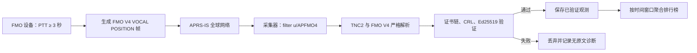

# 基于 FMO V4 `VOCAL` 的全网活跃排行榜说明

## 1. 文档目的

本文说明如何在独立服务中监听 APRS-IS 上的 FMO V4 `VOCAL` 广播，并将通过身份验证的观测结果聚合为全网活跃排行榜。

本文只描述公开的 FMO V4 APRS 广播和标准 APRS-IS 接收机制，不依赖 FMO Companion App、局域网设备接口、MQTT 语音流或设备私钥。

排行榜必须表达为“采集器观察到的、已验证的 `VOCAL` 广播活跃度”，不能表达为精确发言次数、讲话时长、实时说话人或完整 QSO 数量。

## 2. 核心结论

FMO V4 使用全球 APRS-IS 网络广播目标地址为 `APFMO4` 的公开 POSITION/STATUS 帧。`VOCAL` 是其中一种 POSITION 广播类型，由设备在 PTT 持续至少 3 秒时自动触发。

独立采集服务可以：

1. 以只读身份连接 APRS-IS 用户过滤端口。
2. 使用 `u/APFMO4` 订阅全球 FMO V4 广播。
3. 从收到的 TNC2 文本帧中筛选 `VOCAL`。
4. 验证证书链、呼号、有效期、吊销状态和报文签名。
5. 按已验证的证书 UID 或基础呼号进行时间窗口聚合。

它不能仅凭 `,VOCAL,` 字符串计数，也不能根据报文数量推导实际讲话时长。

## 3. 数据链路



## 4. APRS-IS 连接

### 4.1 服务端点

普通客户端应连接 APRS-IS Tier 2 区域轮询地址的用户定义过滤端口 `14580`，例如：

```text
asia.aprs2.net:14580
```

也可以根据部署地区选择 `rotate.aprs2.net`、`noam.aprs2.net`、`euro.aprs2.net` 等轮询地址。采集器应保持单一上游连接，并通过断线重连切换端点，不应同时连接多个上游后直接合并数据，否则会放大重复观测。

全网 FMO 排行榜不需要 APRS-IS 的完整数据流端口；`14580 + u/APFMO4` 已能按目标地址订阅 FMO V4 广播，负载更小。

### 4.2 只读登录

TCP 建连后，先等待服务器发送以 `#` 开头的欢迎行，再发送以 CRLF 结尾的登录命令：

```text
user YOURCALL-SSID pass -1 vers YourCollector 1.0 filter u/APFMO4\r\n
```

字段含义：

| 字段 | 含义 |
|---|---|
| `YOURCALL-SSID` | 合法且唯一的 APRS 登录身份 |
| `pass -1` | 只读、未验证登录；不能向 APRS-IS 发送业务包 |
| `vers` | 无空格的软件名称与版本 |
| `filter u/APFMO4` | 订阅目标地址（TOCALL）为 `APFMO4` 的包 |

服务器通常返回类似：

```text
# logresp YOURCALL-SSID unverified, server ...
```

这里的 `unverified` 只描述 APRS-IS 登录没有发送权限，不表示收到的 FMO V4 报文可信或不可信。FMO 报文可信度必须由采集器独立执行 PKI 和 Ed25519 验证。

### 4.3 接收规则

- APRS-IS 数据使用 TNC2 文本格式，以 CRLF 分隔。
- `#` 开头的行是服务器注释、登录响应或保活，不进入业务统计。
- APRS-IS 单行上限为 512 字节；采集器还应设置有界缓冲，拒绝无限增长的异常行。
- 连接、读取和退避重连都应支持取消与超时。
- 只有验证登录才允许发送业务包；排行榜采集器不需要任何发送能力。

## 5. `VOCAL` 报文识别

### 5.1 线上结构

FMO V4 广播的 TNC2 包头形式为：

```text
呼号-SSID>APFMO4,TCPIP*:有效载荷
```

`VOCAL` 使用带位置的 POSITION 帧，其语义结构为：

```text
CALL-SSID>APFMO4,TCPIP*:=<APRS位置与符号>FMO-V4,VOCAL,CERT:<blob>,S<serverUID>,SIG:<signature>
```

解析器不应依赖示例中的可选视觉空格，而应严格按 APRS POSITION 字段长度定位 symbol table、经纬度、symbol code 和其后的 FMO payload。

### 5.2 最小筛选条件

进入 FMO V4 验证前，至少检查：

```text
destination == "APFMO4"
path 包含 "TCPIP*"
frameType == POSITION
protocol == "FMO-V4"
messageType == "VOCAL"
tokenCount 与 token 顺序完全符合规范
```

有效的 `VOCAL` 业务字段包括：

- APRS 包头中的源呼号和 SSID；
- POSITION 中的纬度、经度及符号；
- `CERT:<blob>` 用户证书；
- `S<serverUID>` 当前连接的 FMO 服务器 UID；
- `SIG:<signature>` 用户 Ed25519 签名。

未知字段、错误顺序、无效数字、非法 Base64url、超长文本或不符合规范的坐标应直接拒绝，不应宽松猜测。

## 6. 身份与签名验证

任何排行榜统计都应在验证完成之后执行。

### 6.1 解码用户证书

1. 去除 `CERT:` 前缀。
2. 按无 padding 的 Base64url 解码为原始 CBOR 字节。
3. 解码为固定 10 元素的用户证书数组。
4. 检查协议标识、版本、消息类型、字段类型和固定字节长度。
5. 提取 `issuerSn`、基础呼号、用户 UID、公钥、签发时间、到期时间和 CA 签名。

证书中的基础呼号必须与 APRS 包头中去掉 SSID 后的大写呼号一致。排行榜的稳定身份建议使用已验证的证书 UID，基础呼号作为展示字段；不要按 `呼号-SSID` 把同一身份拆成多个用户。

### 6.2 验证证书链

使用受信任的 FMO V4 Intermediate CA 公钥，对用户证书元素 0 至 8 构成的确定性 CBOR TBS 数组验证 Ed25519 CA 签名。同时检查：

- `iat <= now < exp`；
- Intermediate CRL 中是否存在用户证书指纹；
- Root CRL 中是否存在签发该用户证书的 Intermediate CA 序列号；
- 信任锚和 CRL 是否来自明确的官方分发源。

吊销命中、证书过期、链验证失败或呼号不一致时必须丢弃该报文。

### 6.3 验证 `VOCAL` 签名

`VOCAL` 的签名不是直接覆盖原始 APRS 文本，而是覆盖固定顺序的确定性 CBOR TBS 数组：

```text
[
  "FMO",
  4,
  "VOCAL",
  callsign,
  ssid,
  latStr,
  lonStr,
  certBlobHash,
  serverUID,
  timeSalt
]
```

其中：

```text
timeSalt = floor(UTC Unix 时间戳 / 600)
```

接收端应分别尝试当前 `timeSalt`、`timeSalt - 1` 和 `timeSalt + 1`，使用用户证书中的 Ed25519 公钥验证 `SIG`。三个候选全部失败时，报文应视为签名无效、过期或重放并丢弃。

## 7. 推荐数据模型

建议分别保存原始接收诊断和已经验证的业务观测，排行榜只读取后者。

```text
VerifiedVocalObservation
- id
- certificateUID
- callsign
- sourceSSID
- serverUID
- latitude
- longitude
- receivedAt
- packetHash
- signatureHash
- collectorInstanceID
```

安全与隐私约束：

- 原始 APRS 包只用于短期解析和故障诊断，避免长期无界保存。
- 公开界面没有业务需要时，不展示精确坐标、完整证书或签名。
- 日志只记录错误类型和计数，不记录完整原始包及精确位置。
- 数据保留时间应与排行榜窗口匹配，并公开统计口径和删除策略。

## 8. 排行榜统计口径

### 8.1 推荐指标

主指标建议命名为：

```text
已验证 VOCAL 广播观测数
```

常用时间窗口：

- 最近 1 小时：即时趋势；
- 最近 24 小时：日活跃榜；
- 最近 7 天：周活跃榜；
- 最近 30 天：长期趋势，但更容易受采集缺口影响。

按“人”聚合时使用 `certificateUID`，按服务器分析时增加 `serverUID` 维度：

```sql
SELECT certificate_uid, callsign, COUNT(*) AS observed_vocal_count
FROM verified_vocal_observations
WHERE received_at >= :window_start
GROUP BY certificate_uid, callsign
ORDER BY observed_vocal_count DESC;
```

建议同时展示：

- 统计窗口；
- 采集服务覆盖率或断线时长；
- 最近观测时间；
- 指标说明链接。

### 8.2 不应提供的指标

仅凭 `VOCAL` 不能可靠计算：

- 实际发言次数；
- 讲话秒数或占用时长；
- 当前正在讲话的人；
- 发言对象或通联双方；
- 完整 QSO 数；
- 小于 3 秒的 PTT 活动。

## 9. 去重与固有歧义

这是排行榜设计中最重要的限制。

APRS-IS 本身会进行短时间重复包抑制。与此同时，FMO V4 `VOCAL` 的签名字段只包含 10 分钟粒度的 `timeSalt`，不包含精确事件时间或随机事件 ID。

因此，当同一用户在同一 10 分钟窗口内位置和服务器均未变化时，多次 `VOCAL` 可能产生相同的语义字段、签名和完整报文。采集器无法从协议层可靠区分：

- 同一事件的网络重复传输；
- 用户在稍后又触发了一次新的 `VOCAL`。

推荐策略：

1. 以规范化 TNC2 业务内容或完整 FMO payload 计算 `packetHash`。
2. 只在短窗口内去重，例如 30 至 60 秒。
3. 超过短窗口再次收到相同报文时，将其记录为新的“观测”，但不要声称它一定是一次新的发言。
4. 不要在整个 10 分钟 `timeSalt` 窗口内按签名永久去重，否则可能严重少算活跃观测。
5. 不要把 APRS-IS 的接收时间当作设备生成报文的精确时间。

排行榜最终反映的是采集器看到的广播活跃度，而不是物理世界中的完整发言事实。

## 10. 可靠性与运行建议

- 使用一个持久上游连接；断线时采用有上限的指数退避和随机抖动。
- 记录连接区间和缺口，用于计算排行榜的采集覆盖率。
- 重连后不要假设普通实时过滤端口会补发缺失历史。
- 解析、验签、存储和排行榜聚合应分层隔离。
- 对原始行、CBOR、Base64url、签名和字段长度设置严格上限。
- 对无效包只累计分类计数，不让单个畸形包中断后续接收。
- 使用持久队列或事务批次写入，避免数据库短暂失败导致网络读取阻塞。
- 监控接收速率、验签失败率、CRL 新鲜度、重连次数和数据写入延迟。
- 采集器只接收数据，不实现 APRS 发包能力。

## 11. 公示与隐私建议

虽然 FMO V4 APRS 广播是公开数据，但将分散事件长期聚合为个人排行榜会放大数据的可见性和可检索性。产品页面应：

- 明确说明数据来自公开 APRS-IS 广播；
- 明确指标是“已验证广播观测数”，不是讲话次数或时长；
- 公布统计窗口、去重规则、采集缺口和更新时间；
- 默认不公开精确位置轨迹；
- 提供合理的纠错、隐藏或退出排行榜渠道；
- 设置有限保留周期，避免无目的的永久行为画像。

## 12. 实施检查清单

### 接收

- [ ] 使用合法 APRS 登录身份建立只读连接。
- [ ] 连接 `14580` 用户过滤端口。
- [ ] 登录行包含 `filter u/APFMO4`。
- [ ] 正确处理 `#` 注释、CRLF 和单行大小限制。
- [ ] 断线后单上游退避重连。

### 解析与信任

- [ ] 严格解析 TNC2、POSITION 和 FMO V4 token。
- [ ] 只接受 `APFMO4`、`TCPIP*` 和 `VOCAL`。
- [ ] 验证证书呼号与包头呼号一致。
- [ ] 验证证书链、有效期和 CRL。
- [ ] 使用确定性 CBOR 和 `timeSalt ±1` 验证 Ed25519 签名。
- [ ] 未验证数据不进入排行榜。

### 聚合

- [ ] 使用证书 UID 作为主身份，呼号作为展示字段。
- [ ] 保存采集端接收时间而不伪造设备精确事件时间。
- [ ] 采用公开、短窗口的去重规则。
- [ ] 指标名称避免使用“发言次数”和“讲话时长”。
- [ ] 展示采集覆盖率和统计窗口。

### 安全与隐私

- [ ] 不持久化不必要的完整原始包和精确位置历史。
- [ ] 不记录完整证书、签名或精确位置到运行日志。
- [ ] 提供数据保留、纠错和退出机制。
- [ ] 不实现与排行榜无关的 APRS 发送功能。

## 13. 官方参考资料

- [FMO 4.0 APRS 报文格式](https://bg5esn.com/docs/fmo-aprs-formate/)
- [FMO 4.0 技术模型](https://bg5esn.com/docs/fmo-model/)
- [APRS-IS：Connecting to APRS-IS](https://www.aprs-is.net/Connecting.aspx)
- [APRS-IS：Server-side Filter Commands](https://www.aprs-is.net/javAPRSFilter.aspx)
- [APRS-IS：APRS Servers](https://www.aprs-is.net/aprsservers.aspx)
- [RFC 8949：CBOR](https://www.rfc-editor.org/rfc/rfc8949.html)
